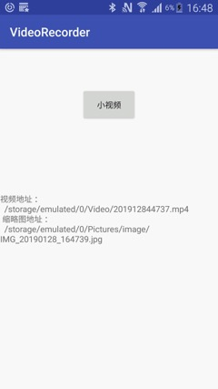
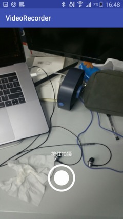
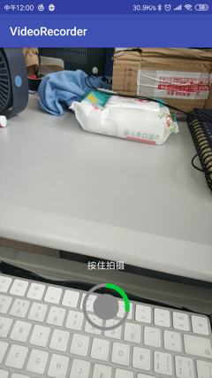
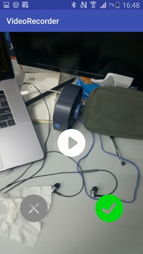

# VideoRecorder
Android 仿微信短视频录制

项目代码分析请移步本人博客：[[28] —— Android 仿微信录制短视频（不使用 FFmpeg）](https://blog.csdn.net/u011133887/article/details/83654724)

## 预览





## Bug 修复与更新日志：

### 更新日志：
- 1.2.0：仿照微信，短按拍照长按拍摄 ——19.05.23
- 1.1.5：增加进度条，修改依赖为 androidx  ——19.05.17
- 1.1.4：修复录制时切出后无法再次播放的问题  ——18.11.12
- 1.1.3：修复录制时间过短导致崩溃的问题 ——18.11.08
- 1.1.2：修复在华为设备不兼容的问题 ——18.11.03
- 1.1：修复录制视频无法在 ios 设备播放的问题 ——18.11.02 

### MediaRecorder: stop failed: -1007
 >java.lang.RuntimeException: stop failed.
  >        at android.media.MediaRecorder.stop(Native Method)

该异常会在部分机型出现，当录制完毕后，执行 `stop()` 函数时出现异常。
解决思路：
1. 检查 MediaRecorder 的视频输出尺寸是否是系统所支持的尺寸
2. 修改 Camera 的预览尺寸与 MediaRecorder 的视频输出尺寸一致
3. 修改 MPEG_4_SP 为 H264
`mRecorder?.setVideoEncoder(MediaRecorder.VideoEncoder.MPEG_4_SP)` -> `mRecorder?.setVideoEncoder(MediaRecorder.VideoEncoder.H264)` 

### stop failed 的另一种情况
读者反馈当录制视频时间过短时或出现崩溃的情况，就此我们可以参考 `stop()` 方法的备注：
```
/**
     * Stops recording. Call this after start(). Once recording is stopped,
     * you will have to configure it again as if it has just been constructed.
     * Note that a RuntimeException is intentionally thrown to the
     * application, if no valid audio/video data has been received when stop()
     * is called. This happens if stop() is called immediately after
     * start(). The failure lets the application take action accordingly to
     * clean up the output file (delete the output file, for instance), since
     * the output file is not properly constructed when this happens.
     *
     * @throws IllegalStateException if it is called before start()
     */
    public native void stop() throws IllegalStateException;
```
>如果在调用`stop()`时未收到有效的音频/视频数据，则会抛出`RuntimeException`。如果在`start()`之后立即调用`stop()`，则会发生这种情况。

原因就是在我们结束录制时，整个过程总时长太短，还没有接收到有效地数据。对于这种情况，我们有两种解决方法：

1. `try{}catch{}` 捕获改异常，并提示用户录制时间太短，然后允许用户重新录制；
2. 人为延时，在 `stop()` 方法调用前确定总时长，当总时长小于 1s 时，`Thread.sleep(xxx)` 

